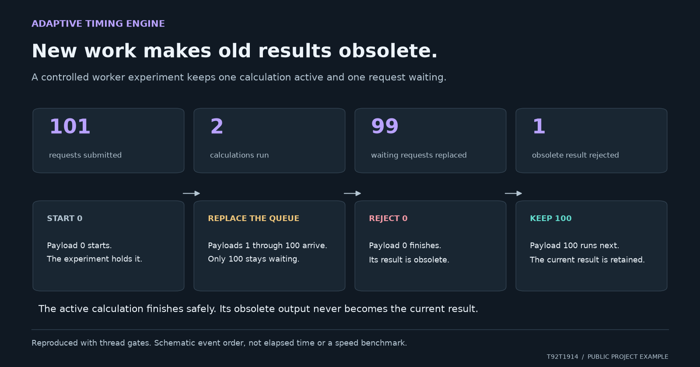
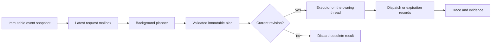

# Adaptive Timing Engine

[](https://github.com/T92T1914/adaptive-timing-engine/actions/workflows/ci.yml)

**A way to inspect timing variation and what happens when plans change.** Pure Python 3.11+, with no runtime dependencies.

I wanted to see how workload, recovery and timing variation affect which tasks can actually run. This package makes those interactions visible in an offline trace explorer. It also handles a problem that comes up when planning happens in the background: an old calculation finishing after a newer request has made it obsolete.

I generalized the request mailbox from a larger private application, then built an independent event model, executor and experiment around it. Everything needed to run this version is here. The workloads and parameters are synthetic, so the results describe this simulation rather than validated human performance.

[Run it](#run-it) · [Measured examples](#measured-examples) · [Architecture](#architecture) · [Design decisions](docs/design-decisions.md) · [API example](examples/replanning.py)

[Explore the browser demo](https://t92t1914.github.io/adaptive-timing-engine/) · [Open in Codespaces](https://codespaces.new/T92T1914/adaptive-timing-engine)

## Run it

```sh
git clone https://github.com/T92T1914/adaptive-timing-engine.git
cd adaptive-timing-engine
python -m adaptive_timing demo
python -m unittest discover -s tests -v
```

Open `reports/demo.html` in a browser. It is a self contained trace explorer: choose a workload, disable an individual mechanism, switch the paired seed, zoom into a time interval, and export the selected trace. It works offline and makes no network requests.

The [committed demonstration](docs/evidence/demo.html) can also be downloaded and opened directly. [Results](docs/evidence/results.md), [summary JSON](docs/evidence/results.json), and [compressed full traces](docs/evidence/traces.json.gz) are available without running the project.

```sh
python -m adaptive_timing benchmark --events 240 --output reports/comparison
python examples/replanning.py
pip install .
adaptive-timing demo --events 120
```

Installation is optional when running from a checkout. The wheel includes the viewer template. Tests use only the standard library; CI runs them on Python 3.11, 3.12, and 3.13.

## Measured examples

[](docs/visual-example.md)

One calculation can run while one request waits. New requests replace the waiting request; an obsolete result is rejected when the active calculation finishes. The diagram shows event order, not elapsed time.
[Reproduce and inspect the values](docs/visual-example.md).

The committed experiment compares **4 workloads × 4 policy variants × 3 seeds**, with 240 tasks per case. Policies receive identical events and identical per event random draws. Seeds are 7, 42, and 73; all parameters and interpreter details are recorded alongside the results.

| Question | Observation at seed 42 | What it establishes |
| --- | --- | --- |
| Does load response change the trace? | In the burst workload, full policy absolute offset p95 is **34.942 ms**, versus **28.060 ms** with load response disabled. | The workload mechanism affects observable timing. This is not a realism score. |
| Does more variation improve admission? | Under saturation, the full policy admits **96/240** tasks; disabling variation admits **108/240**. | The variability/admission tradeoff is visible. No universal improvement is claimed. |
| Can queued planning grow without bound? | **101 requests → 2 calculations**, with **99 queued requests replaced** and **1 obsolete result rejected** in a gated worker experiment. | One active calculation and one waiting request; obsolete output cannot replace current work. |
| Can a valid plan still miss deadlines? | The execution experiment compares **2, 40, and 150 ms** virtual polling intervals, recording admitted, dispatched, and expired tasks separately. | Planning feasibility does not guarantee execution timeliness. |

See the [complete results](docs/evidence/results.md) for every seed, including results that are less favorable. Wall clock measurements are specific to the recorded environment. Virtual polling delays are simulated inputs, not measured operating system wakeup latency.

## Architecture



| Component | Responsibility | Decision worth inspecting |
| --- | --- | --- |
| [`model.py`](adaptive_timing/model.py) | Timing policy, workload, recovery, resource windows | Noise is keyed by event identity, so an ablation cannot accidentally change its random inputs. |
| [`worker.py`](adaptive_timing/worker.py) | Latest request computation and versioned outcomes | A new request invalidates already completed pending output immediately, not only when its replacement finishes. |
| [`runtime.py`](adaptive_timing/runtime.py) | Plan adoption and incremental virtual dispatch | Issued IDs and resource reservations survive replanning; the poll budget also counts duplicates and deferred tasks. |
| [`experiment.py`](adaptive_timing/experiment.py) | Generated data and paired comparisons | Full traces accompany measurements, and execution expiration is separate from planning rejection. |
| [`tests/test_engine.py`](tests/test_engine.py) | Failure cases and independent invariants | Deterministic thread gates expose stale output races without relying on convenient sleep timing. |

An event has an immutable ID, target time, earliest start, completion deadline, service duration, and resource. A resource is a serial server; different resources can operate concurrently. The planner processes events by target time and ID, applies the configured timing policy, and either admits an event within its feasible interval or explicitly rejects it.

## Scope and limits

* The behavioral policy uses workload dependent variation and a synthetic effort/recovery state. There are no fitted human profiles, learned model weights, or claims of human indistinguishability.
* The planner knows the full input batch. Its centered workload window uses future information; it is not a causal online estimator or an optimal admission algorithm.
* The background worker is a thread. It keeps planning out of the polling method but does not isolate CPU bound Python work from the GIL. It cannot forcibly cancel an in progress calculation.
* Polling processes at most its candidate budget. Plan validation happens during construction, before adoption. Python reference cleanup, allocation, garbage collection, locking, and OS scheduling still prevent a hard real time latency guarantee.
* The executor returns records; it does not actuate devices or an external application. Service durations are assumed inputs, not measurements of a real device. Event IDs cannot be reused during an executor session; its issued ID set grows until that session is discarded.
* The tests and experiments demonstrate this independent implementation. They do not transfer validation or performance results from the private application.

## License

MIT. See [LICENSE](LICENSE).

## Questions and contributions

Found a problem or have a useful comparison? [Open an issue](https://github.com/T92T1914/adaptive-timing-engine/issues) with a small example I can run. The [contribution guide](CONTRIBUTING.md) covers setup, checks and the evidence to include with a change.
