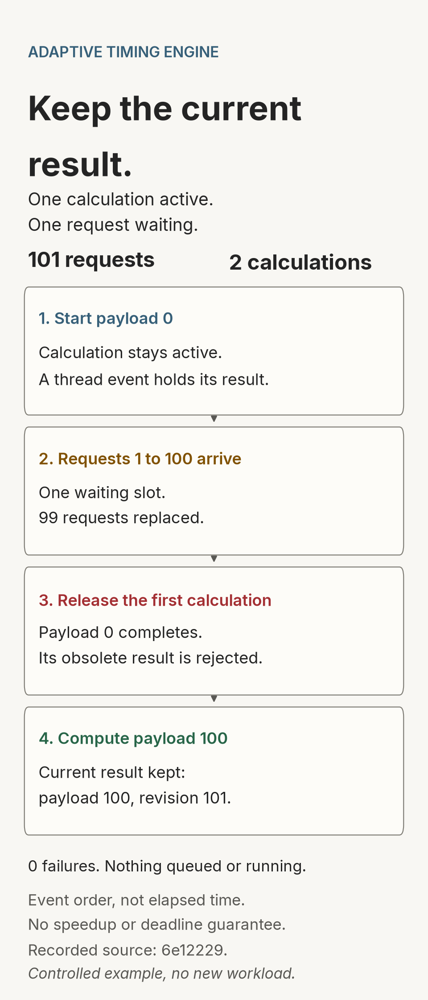
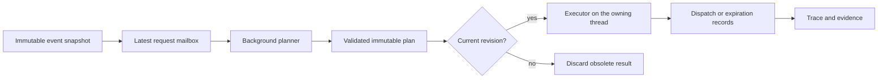

# Adaptive Timing Engine

[](https://github.com/T92T1914/adaptive-timing-engine/actions/workflows/ci.yml)

**A way to inspect timing variation and what happens when plans change.** Pure Python 3.11+, with no runtime dependencies.

I wanted to see how workload, recovery and timing variation affect which tasks can actually run. This package makes those interactions visible in an offline trace explorer. It also handles a problem that comes up when planning happens in the background: an old calculation finishing after a newer request has made it obsolete.

I generalized the request mailbox from a larger private application, then built an independent event model, executor and experiment around it. Everything needed to run this version is here. The workloads and parameters are synthetic, so the results describe this simulation rather than validated human performance.

[Run it](#run-it) · [Measured examples](#measured-examples) · [Architecture](#architecture) · [Design decisions](docs/design-decisions.md) · [API example](examples/replanning.py)

[Explore the browser demo](https://t92t1914.github.io/adaptive-timing-engine/) · [Open in Codespaces](https://codespaces.new/T92T1914/adaptive-timing-engine)

## Run it

```sh
git clone https://github.com/T92T1914/adaptive-timing-engine.git
cd adaptive-timing-engine
python -m adaptive_timing demo
python -m unittest discover -s tests -v
```

Open `reports/demo.html` in a browser. It is a self contained trace explorer: choose a workload, disable an individual mechanism, switch the paired seed, zoom into a time interval, and export the selected trace. It works offline and makes no network requests.

The [current explorer](https://t92t1914.github.io/adaptive-timing-engine/explorer.html) presents the saved traces with Auto, Clair and Obscur appearances. Download its HTML file to keep using it offline. Switching appearance preserves the workload, policy, seed and visible time window. Planned, constrained and rejected tasks use different marks as well as colors. Inter uses installed local faces with a system fallback, without downloading fonts.

The [committed demonstration](docs/evidence/demo.html) remains an unchanged historical artifact. [Results](docs/evidence/results.md), [summary JSON](docs/evidence/results.json), and [compressed full traces](docs/evidence/traces.json.gz) are available without running the project. To render those same values with the current presentation, without running another experiment:

```sh
python tools/render_saved_viewer.py --output reports/retained
```

Open `reports/retained/explorer.html`. Its provenance records the trace archive hash, renderer identity and theme source. The retained experiment did not record an evaluated Git revision, so that field remains unknown. A new rendering does not supply missing experimental provenance. See [the presentation contract](docs/presentation.md) for font, data and verification boundaries.

```sh
python -m adaptive_timing benchmark --events 240 --output reports/comparison
python examples/replanning.py
pip install .
adaptive-timing demo --events 120
```

Installation is optional when running from a checkout. The wheel includes the viewer template and its presentation resources. Python tests use only the standard library, and CI runs them on Python 3.11, 3.12, and 3.13. Separate development-only browser checks exercise the generated viewer.

## Measured examples

<a href="docs/visual-example.md">
  <picture>
    <source media="(min-width: 1024px) and (prefers-color-scheme: dark)" srcset="docs/adaptive-timing-obscur-wide.png">
    <source media="(min-width: 1024px) and (prefers-color-scheme: light)" srcset="docs/adaptive-timing-clair-wide.png">
    <source media="(prefers-color-scheme: dark)" srcset="docs/adaptive-timing-obscur.png">
    <source media="(prefers-color-scheme: light)" srcset="docs/adaptive-timing-clair.png">
    
  </picture>
</a>

One calculation can run while one request waits. New requests replace the waiting request; an obsolete result is rejected when the active calculation finishes. The diagram shows event order, not elapsed time.
[Reproduce and inspect the values](docs/visual-example.md).

The committed experiment compares **4 workloads × 4 policy variants × 3 seeds**, with 240 tasks per case. Policies receive identical events and identical per event random draws. Seeds are 7, 42, and 73; all parameters and interpreter details are recorded alongside the results.

| Question | Observation at seed 42 | What it establishes |
| --- | --- | --- |
| Does load response change the trace? | In the burst workload, full policy absolute offset p95 is **34.942 ms**, versus **28.060 ms** with load response disabled. | The workload mechanism affects observable timing. This is not a realism score. |
| Does more variation improve admission? | Under saturation, the full policy admits **96/240** tasks; disabling variation admits **108/240**. | The variability/admission tradeoff is visible. No universal improvement is claimed. |
| Can queued planning grow without bound? | **101 requests → 2 calculations**, with **99 queued requests replaced** and **1 obsolete result rejected** in a gated worker experiment. | One active calculation and one waiting request; obsolete output cannot replace current work. |
| Can a valid plan still miss deadlines? | The execution experiment compares **2, 40, and 150 ms** virtual polling intervals, recording admitted, dispatched, and expired tasks separately. | Planning feasibility does not guarantee execution timeliness. |

See the [complete results](docs/evidence/results.md) for every seed, including results that are less favorable. Wall clock measurements are specific to the recorded environment. Virtual polling delays are simulated inputs, not measured operating system wakeup latency.

### Planning as information arrives

`CausalScheduler` receives immutable announcements, updates and cancellations.
A task announced before its release is legitimately known future work. A fact
that has not arrived is absent from the planning snapshot. Updating the known
catalog invalidates old results, while issued IDs and service reservations
survive. The [information contract and API example](docs/causal-policy.md)
explain equal timestamp ordering, terminal states and delayed results.

The new [causal comparison report](https://t92t1914.github.io/adaptive-timing-engine/causal.html)
retains 24 pairs across four synthetic workloads, two delivery patterns and
three seeds. The causal policy dispatched fewer tasks in 9 pairs, the same
number in 7 and more in 8. At seed 42, steady work with revisions dispatched
100 tasks under the causal policy and 111 under the offline comparator.
Saturation also exposed cases where repeated causal replanning dispatched more
work. These are whole policy comparisons, including different information and
effort estimates. They do not establish a universal winner.

The [protocol](docs/causal-protocol.md) and implementation were committed before
the run. [Every result](docs/causal-evidence/results.md),
[summary values](docs/causal-evidence/summary.json) and
[raw traces](docs/causal-evidence/raw.json.gz) are retained. Planned entries,
distinct admissions, rejection, expiration, dispatch and cancellation remain
separate. External completion is unknown. This study does not rerun or supply
a missing evaluated revision for the original batch experiment.

### Optional real execution

The [optional CUDA application](docs/cuda-application.md) connects owned Python
submission snapshots to the runtime's reusable histogram. A single resource
owner handles repeated calls and explicit close. The runnable example checks
full outputs, cancellation requests, obsolete generations and bounded capacity.
It requires an explicitly CUDA-enabled runtime package. Default imports and
simulation studies keep their existing dependencies and behavior.

The default explorer and historical comparisons remain simulations. An optional
[`RealExecutor`](docs/real-execution.md) can accept their dispatch records and
run synchronous callables. It records actual start, completion and owner
reconciliation on a separate monotonic wall clock. Cancellation requests and
stale results remain distinct from physical completion. A resource stays
reserved until its callable has returned and its result has been reconciled.

```sh
python examples/real_execution.py --output reports/real-execution.json
```

This example executes and checks two real CPU sums. It adds no runtime
dependencies and makes no throughput or real deadline claim. The
[execution contract](docs/real-execution.md) explains input ownership, bounded
submission, cooperative cancellation and the synchronization a future device
adapter must provide.

An [optional native CPU example](docs/real-execution.md#explicit-native-cpu-example)
uses the separately installed numerical runtime for reduction, tiled histograms
and a stencil. It verifies submission snapshots and actual completed results
without changing the default dependencies or historical comparisons.

## Architecture


```mermaid
flowchart LR
    A[Immutable event snapshot] --> B[Latest request mailbox]
    B --> C[Background planner]
    C --> D[Validated immutable plan]
    D --> E{Current revision?}
    E -->|yes| F[Executor on the owning thread]
    E -->|no| G[Discard obsolete result]
    F --> H[Dispatch or expiration records]
    H --> I[Trace and evidence]
```

| Component | Responsibility | Decision worth inspecting |
| --- | --- | --- |
| [`model.py`](adaptive_timing/model.py) | Timing policy, workload, recovery, resource windows | Noise is keyed by event identity, so an ablation cannot accidentally change its random inputs. |
| [`causal.py`](adaptive_timing/causal.py) | Delivered information, incremental planning and result adoption | A result must match the current immutable request and generation before it can change the session. |
| [`worker.py`](adaptive_timing/worker.py) | Latest request computation and versioned outcomes | A new request invalidates already completed pending output immediately, not only when its replacement finishes. |
| [`runtime.py`](adaptive_timing/runtime.py) | Plan adoption and incremental virtual dispatch | Issued IDs and resource reservations survive replanning; the poll budget also counts duplicates and deferred tasks. |
| [`execution.py`](adaptive_timing/execution.py) | Optional callable execution and observed completion | A cancellation request or stale result does not release a running operation's resource. |
| [`experiment.py`](adaptive_timing/experiment.py) | Generated data and paired comparisons | Full traces accompany measurements, and execution expiration is separate from planning rejection. |
| [`tests/test_engine.py`](tests/test_engine.py) | Failure cases and independent invariants | Deterministic thread gates expose stale output races without relying on convenient sleep timing. |

An event has an immutable ID, target time, earliest start, completion deadline, service duration, and resource. A resource is a serial server; different resources can operate concurrently. The planner processes events by target time and ID, applies the configured timing policy, and either admits an event within its feasible interval or explicitly rejects it.

## Scope and limits

* The behavioral policy uses workload dependent variation and a synthetic effort/recovery state. There are no fitted human profiles, learned model weights, or claims of human indistinguishability.
* `build_plan` is the preserved offline comparator. It knows the full input batch and uses a centered workload window. `CausalScheduler` only counts delivered outstanding work and builds effort from virtual dispatch history plus the current plan. Neither is an optimal admission algorithm.
* The causal session uses one complete delivery group per timestamp. Rejected, expired, dispatched and canceled IDs are terminal. It clears unissued work when new information arrives, which can lose opportunities while replacement planning is delayed. See the [causal contract](docs/causal-policy.md) before integrating an asynchronous caller.
* The background worker is a thread. It keeps planning out of the polling method but does not isolate CPU bound Python work from the GIL. It cannot forcibly cancel an in progress calculation.
* Polling processes at most its candidate budget. Plan validation happens during construction, before adoption. Python reference cleanup, allocation, garbage collection, locking, and OS scheduling still prevent a hard real time latency guarantee.
* The default executor returns virtual dispatch records. Service durations are assumed inputs, not measurements of a real device. The optional callable executor records actual completion separately and requires synchronous completion from every adapter. Event IDs cannot be reused during either executor session. Its issued ID set grows until that session is discarded.
* The tests and experiments demonstrate this independent implementation. They do not transfer validation or performance results from the private application.

## License

MIT. See [LICENSE](LICENSE).

## Questions and contributions

Found a problem or have a useful comparison? [Open an issue](https://github.com/T92T1914/adaptive-timing-engine/issues) with a small example I can run. The [contribution guide](CONTRIBUTING.md) covers setup, checks and the evidence to include with a change.

## Engineering skills in this project

I use this project to study what happens when new work arrives before the old calculation finishes. It connects concurrency, scheduling and diagnostics in a small system where I can inspect the event trace.

- **Concurrency.** Inspect the worker that replaces waiting requests and rejects obsolete results. [Inspect the work](adaptive_timing/worker.py).
- **Runtime state.** Follow plan adoption, resource reservations and bounded dispatch. [Inspect the work](adaptive_timing/runtime.py).
- **Controlled experiments.** Compare the same workload and seed with one mechanism disabled. [Inspect the work](docs/evidence/results.md).

These patterns are useful in backend services and interactive applications. The simulation is synthetic and does not establish hard real-time guarantees or a calibrated human-performance model.

See [sharing previews](docs/sharing-preview.md) for the maintained link image and its source.
